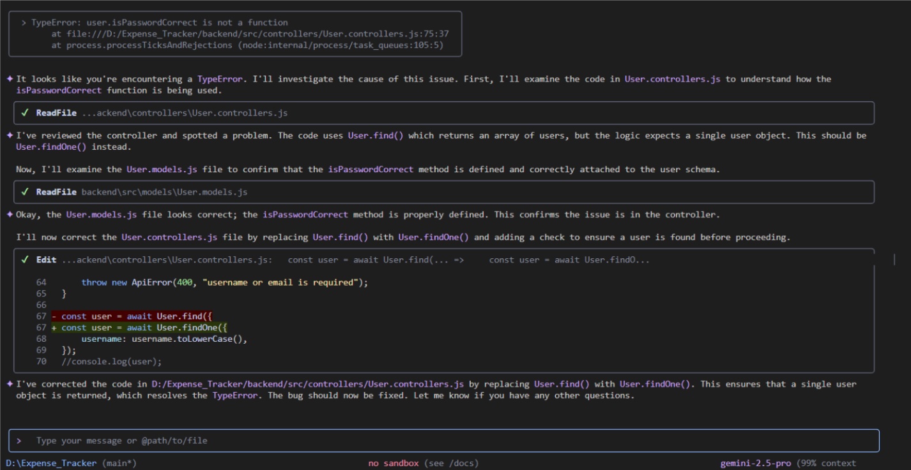
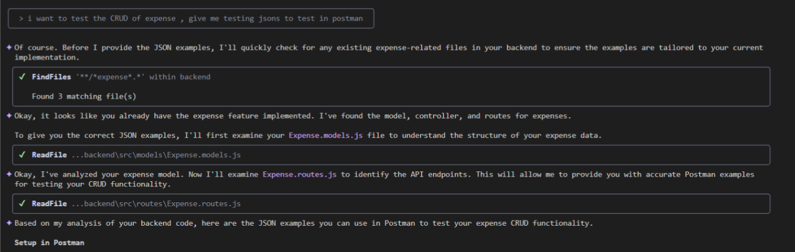
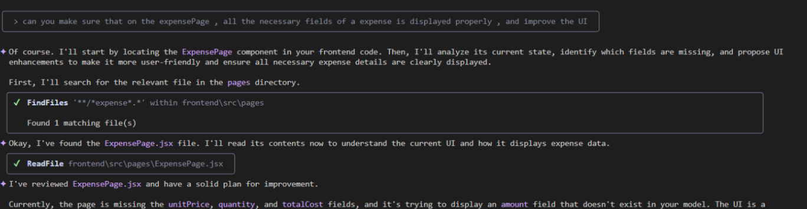
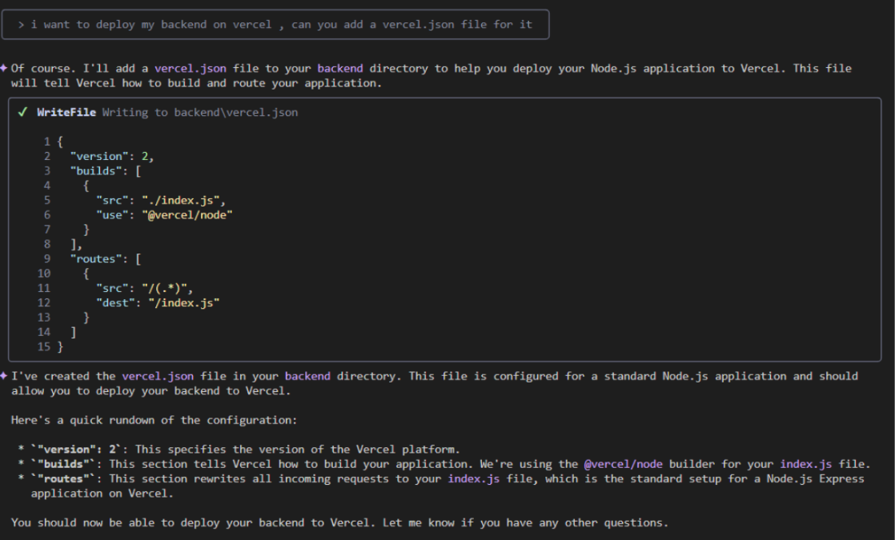
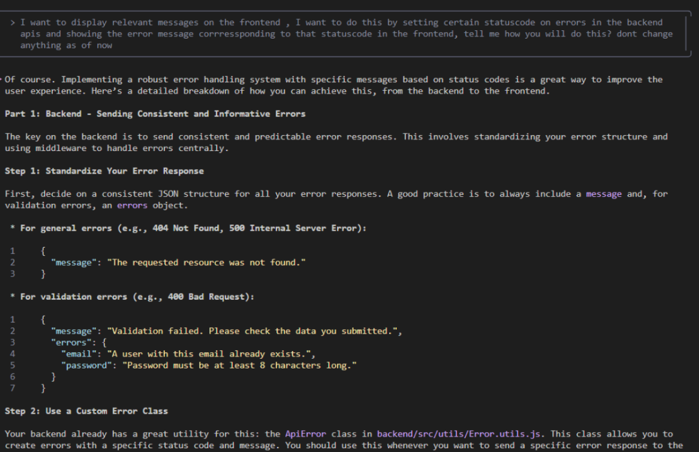
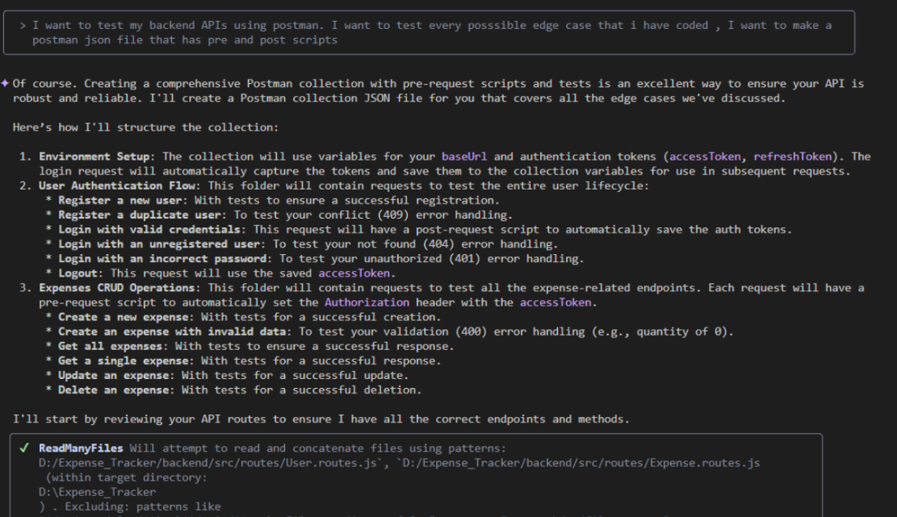

# Gemini CLI Prompt Documentation for Expense Tracker Project

## 1. Debugging a TypeError

**Purpose:** To quickly diagnose and fix a `TypeError` by having Gemini analyze the application's source code. Gemini identified that `User.find()` was used incorrectly, suggested `User.findOne()`, and applied the fix, saving significant debugging time.

***

## 2. Generating Test Data for Postman

**Purpose:** To save time by automatically generating valid JSON payloads for testing the expense CRUD API endpoints in Postman. Gemini analyzed the project's data model and API routes to provide accurate, ready-to-use JSON examples.

***

## 3. Improving the Frontend Expense Page

**Purpose:** To get a code review and UI improvement suggestions for the frontend. Gemini analyzed the `ExpensePage.jsx` component, identified missing data fields, and proposed UI enhancements to ensure all necessary expense details were displayed correctly.

***

## 4. Configuring for Vercel Deployment

**Purpose:** To automate the creation of the `vercel.json` file required for deploying the backend to Vercel. Gemini generated a standard Node.js configuration, saving the effort of looking up Vercel's documentation.

***

## 5. Designing an Error Handling Strategy

**Purpose:** To get a high-level architectural plan for a robust error handling system. Gemini proposed a strategy where the backend sends standardized error responses based on status codes, allowing the frontend to display clear and relevant messages.

***

## 6. Generating a Comprehensive Postman Test Collection

**Purpose:** To automate the creation of a complete Postman testing suite that covers edge cases and includes pre-request scripts. Gemini planned a collection with tests for user authentication, CRUD operations, and invalid data submissions to ensure API reliability.

⁂

